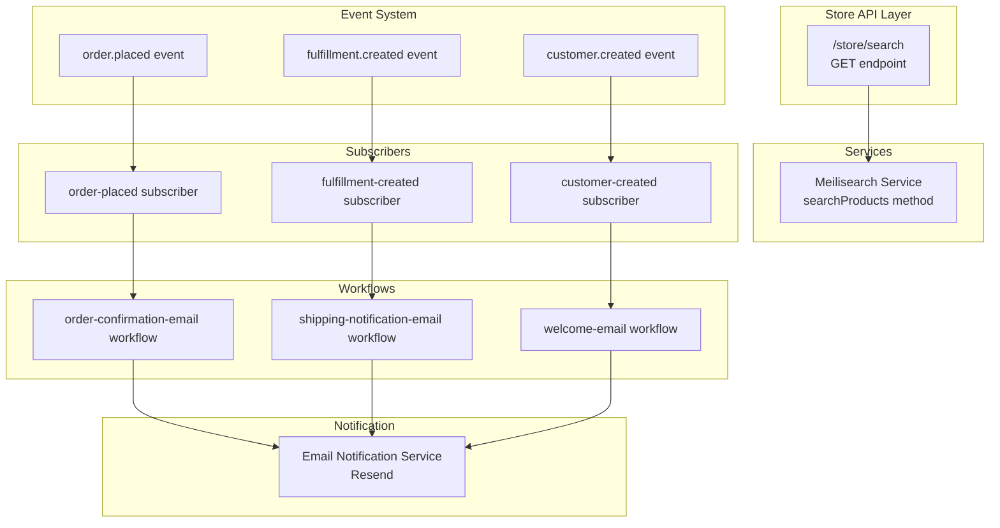

# Design Document: Backend Store API Completion

## Overview

This design completes the Medusa backend API by implementing two critical missing features: product search endpoints for the storefront and transactional email workflows. The implementation leverages existing infrastructure (Meilisearch service and Resend notification service) and follows established Medusa patterns for API routes, workflows, and event subscribers.

The CMS store routes already exist and are not part of this implementation.

## Architecture

The implementation follows Medusa's modular architecture with clear separation between API routes, workflows, and event subscribers:



## Components and Interfaces

### 1. Store Search Route

**Location:** `src/api/store/search/route.ts`

**Interface:**
```typescript
GET /store/search

Query Parameters:
- q: string (required) - The search query text
- limit: number (optional, default: 20) - Maximum results to return
- offset: number (optional, default: 0) - Number of results to skip

Response:
{
  products: Array<{
    id: string
    title: string
    handle: string
    description: string
    thumbnail: string
    status: string
  }>
  count: number
  limit: number
  offset: number
}

Error Responses:
- 400: Missing or invalid query parameter
- 503: Meilisearch service unavailable
```

### 2. Meilisearch Service Enhancement

**Location:** `src/modules/meilisearch/service.ts`

**New Method:**
```typescript
async searchProducts(query: string, options?: { limit?: number, offset?: number }): Promise<{
  hits: Array<any>
  estimatedTotalHits: number
}>
```

### 3. Email Workflows

#### Order Confirmation Workflow

**Location:** `src/workflows/order-confirmation-email/`

**Input:**
```typescript
{
  order_id: string
}
```

**Steps:**
1. Retrieve order with relations (items, customer, shipping_address)
2. Format order confirmation email HTML
3. Send email via notification service

#### Shipping Notification Workflow

**Location:** `src/workflows/shipping-notification-email/`

**Input:**
```typescript
{
  fulfillment_id: string
}
```

**Steps:**
1. Retrieve fulfillment with relations (order, customer, labels)
2. Format shipping notification email HTML
3. Send email via notification service

#### Welcome Email Workflow

**Location:** `src/workflows/welcome-email/`

**Input:**
```typescript
{
  customer_id: string
}
```

**Steps:**
1. Retrieve customer details
2. Format welcome email HTML
3. Send email via notification service

### 4. Event Subscribers

**Locations:**
- `src/subscribers/order-placed.ts`
- `src/subscribers/customer-created.ts`

Note: The fulfillment-created subscriber already exists but needs enhancement to trigger shipping notification workflow.

**Pattern:**
```typescript
export default async function handler({ event: { data }, container }: SubscriberArgs<any>) {
  const { id } = data
  await workflowName(container).run({ input: { id } })
}

export const config: SubscriberConfig = {
  event: "event.name"
}
```

## Data Models

### Search Request
```typescript
{
  q: string           // Search query text
  limit?: number      // Max results (default: 20, max: 100)
  offset?: number     // Pagination offset (default: 0)
}
```

### Search Response
```typescript
{
  products: Product[]  // Array of matching products
  count: number        // Total number of matches
  limit: number        // Applied limit
  offset: number       // Applied offset
}
```

### Product Search Document
```typescript
{
  id: string
  title: string
  handle: string
  description: string
  thumbnail: string
  status: string
}
```

### Email Notification Data

**Order Confirmation:**
```typescript
{
  order_number: string
  customer_name: string
  customer_email: string
  items: Array<{
    title: string
    quantity: number
    unit_price: number
  }>
  total: number
  order_date: Date
  shipping_address: Address
}
```

**Shipping Notification:**
```typescript
{
  order_number: string
  customer_name: string
  customer_email: string
  tracking_number: string
  carrier: string
  estimated_delivery?: Date
}
```

**Welcome Email:**
```typescript
{
  customer_name: string
  customer_email: string
  created_at: Date
}
```


### 5. Email Templates

Each workflow will include a step that formats HTML emails. The templates should be simple, readable HTML with inline styles for email client compatibility.

**Template Structure:**
- Header with store branding
- Main content area with relevant information
- Footer with contact information and unsubscribe link (future enhancement)

## Correctness Properties

A property is a characteristic or behavior that should hold true across all valid executions of a system - essentially, a formal statement about what the system should do. Properties serve as the bridge between human-readable specifications and machine-verifiable correctness guarantees.

### Property 1: Search query passthrough

*For any* valid search query string, calling the /store/search endpoint should pass that exact query to the Meilisearch service and return the results from Meilisearch without modification.

**Validates: Requirements 1.1, 1.2**

### Property 2: Pagination limits search results

*For any* search query with a specified limit value, the number of products returned should not exceed that limit, even if more matches exist.

**Validates: Requirements 1.3, 5.3**

### Property 3: Search results contain required fields

*For any* product returned in search results, the response object should include all required fields: id, title, handle, description, thumbnail, and status.

**Validates: Requirements 1.4**

### Property 4: Event triggers workflow execution

*For any* Medusa event (order.placed, fulfillment.created, customer.created), when the event is emitted, the corresponding subscriber should trigger its associated workflow.

**Validates: Requirements 2.1, 3.1, 4.1**

### Property 5: Workflow retrieves complete data

*For any* workflow execution with a valid entity ID, the workflow should successfully retrieve all required data fields for that entity type before proceeding to email formatting.

**Validates: Requirements 2.2, 3.2, 4.2**

### Property 6: Email formatting includes required content

*For any* email workflow with valid input data, the formatted HTML email should contain all required information fields specific to that email type (order details for confirmations, tracking for shipping, customer name for welcome).

**Validates: Requirements 2.3, 3.3, 4.3, 6.1, 6.2, 6.3**

### Property 7: Workflow sends email via notification service

*For any* email workflow with valid formatted email content, the workflow should invoke the Email_Notification_Service with the correct recipient email address and formatted content.

**Validates: Requirements 2.4, 3.4, 4.4**

### Property 8: HTML email structure validity

*For any* generated email HTML, the output should be valid HTML with proper opening and closing tags and inline CSS styling for email client compatibility.

**Validates: Requirements 6.4**

### Property 9: Indexed products contain searchable fields

*For any* product indexed in Meilisearch, the indexed document should include title, handle, and description fields to enable text search matching.

**Validates: Requirements 5.1**

## Error Handling

### Search Route Error Handling

1. **Missing query parameter**: Return 400 with message "Search query (q) is required"
2. **Meilisearch unavailable**: Return 503 with message "Search service temporarily unavailable"
3. **Invalid pagination parameters**: Sanitize to safe defaults (limit: 20, offset: 0, max limit: 100)

### Email Workflow Error Handling

1. **Missing customer email**: Log error with entity ID, complete workflow without sending
2. **Invalid email format**: Log error with email value, complete workflow without sending
3. **Email service failure**: Log error with failure details, complete workflow without retrying
4. **Missing entity data**: Log error with entity ID, complete workflow without sending

**Error Handling Philosophy:**
- Email workflows should never throw exceptions that block order processing
- All errors should be logged for monitoring and debugging
- Workflows should complete successfully even when emails cannot be sent
- This ensures transactional emails don't impact core business operations

## Testing Strategy

### Unit Testing

Unit tests will focus on specific examples and edge cases:

1. **Search Route Tests:**
   - Valid search with results
   - Search with no results
   - Missing query parameter (400 error)
   - Invalid pagination parameters (sanitization)
   - Meilisearch service error handling

2. **Workflow Tests:**
   - Each workflow with valid input data
   - Missing customer email handling
   - Invalid email format handling
   - Email service failure handling
   - Missing entity data handling

3. **Subscriber Tests:**
   - Event emission triggers workflow
   - Workflow receives correct input data

### Property-Based Testing

Property tests will verify universal correctness properties using a property-based testing library (fast-check for TypeScript). Each test will run a minimum of 100 iterations with randomly generated inputs.

**Test Configuration:**
- Library: fast-check
- Minimum iterations: 100 per property
- Each test tagged with: **Feature: backend-store-api-completion, Property {N}: {property_text}**

**Properties to Test:**
1. Search query passthrough (Property 1)
2. Pagination limits (Property 2)
3. Search result field completeness (Property 3)
4. Event-to-workflow triggering (Property 4)
5. Workflow data retrieval completeness (Property 5)
6. Email content completeness (Property 6)
7. Email service invocation (Property 7)
8. HTML validity (Property 8)
9. Indexed product field completeness (Property 9)

### Integration Testing

Integration tests will verify end-to-end flows:
- Search request → Meilisearch → Response
- Event emission → Subscriber → Workflow → Email service
- Multiple concurrent search requests
- Multiple concurrent email workflows

### Testing Priorities

1. Property tests for core correctness (Properties 1-9)
2. Unit tests for error handling and edge cases
3. Integration tests for end-to-end validation

The dual testing approach ensures both specific edge cases are handled correctly (unit tests) and general correctness holds across all inputs (property tests).

