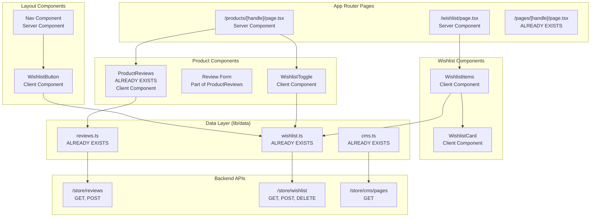
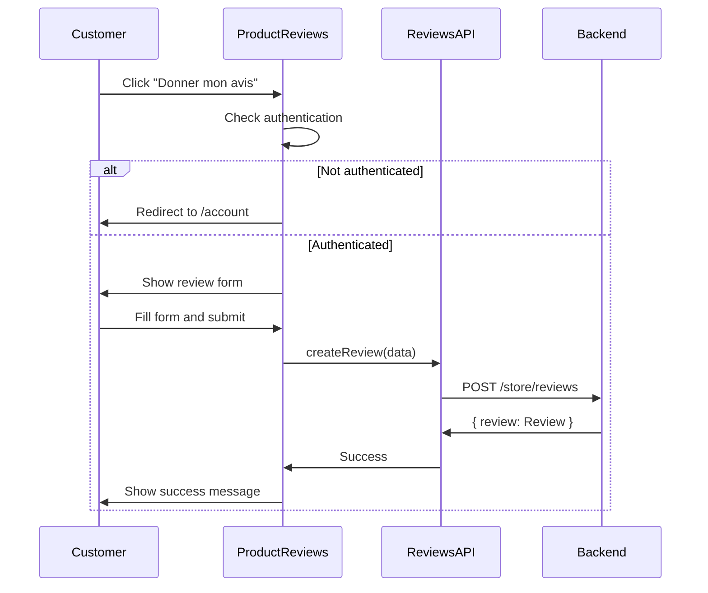
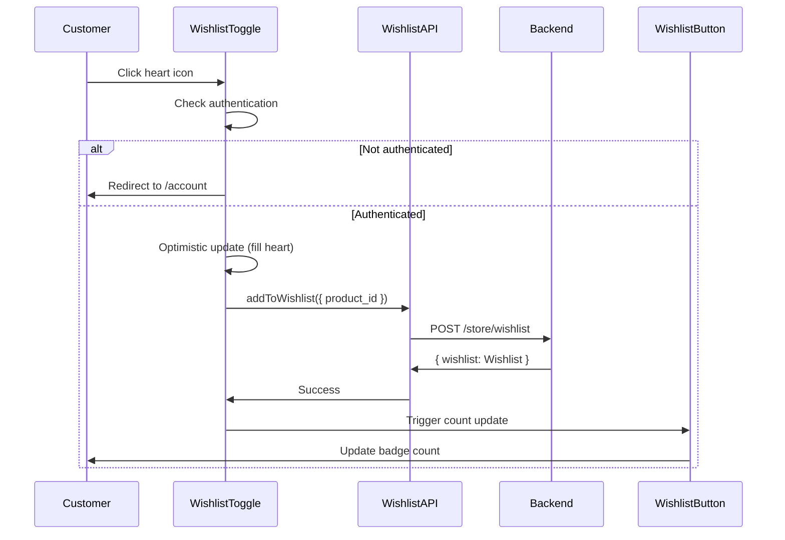

# Design Document: Storefront Features Integration

## Overview

This design integrates three backend features into the Medusa Next.js storefront: Reviews, Wishlist, and CMS Pages. The implementation follows Next.js 14 App Router patterns with server and client components, leveraging the existing @medusajs/ui component library and established data fetching patterns.

The backend APIs are already implemented and functional. This design focuses on creating the frontend layer: UI components, pages, routing, and state management to expose these features to customers.

Key architectural decisions:
- Server Components for initial data fetching and SEO
- Client Components for interactive features (forms, buttons with state)
- Existing data fetching layer in lib/data/ already has reviews.ts and wishlist.ts
- Follow established patterns from cart, search, and CMS banners implementations

## Architecture

The implementation follows Next.js 14 App Router architecture with clear separation between server and client components:



## Components and Interfaces

### 1. WishlistButton Component (NEW)

**Location:** `src/modules/layout/components/wishlist-button/index.tsx`

**Type:** Client Component (needs interactivity and state)

**Purpose:** Display wishlist icon with item count in navigation bar

**Interface:**
```typescript
// Server wrapper component
export default async function WishlistButton() {
  const wishlist = await getWishlist()
  return <WishlistButtonClient itemCount={wishlist?.items?.length || 0} />
}

// Client component
"use client"
function WishlistButtonClient({ itemCount }: { itemCount: number }) {
  // Renders heart icon with badge count
  // Navigates to /wishlist on click
}
```

**Props:**
- itemCount: number - Number of items in wishlist

**Behavior:**
- Displays heart icon from @medusajs/icons
- Shows badge with count when itemCount > 0
- Navigates to /wishlist on click
- Follows same pattern as CartButton

### 2. WishlistToggle Component (NEW)

**Location:** `src/modules/products/components/wishlist-toggle/index.tsx`

**Type:** Client Component (needs interactivity)

**Purpose:** Add/remove product from wishlist on product pages and cards

**Interface:**
```typescript
"use client"
export default function WishlistToggle({ 
  productId, 
  variantId, 
  isInWishlist,
  size = "default"
}: { 
  productId: string
  variantId?: string
  isInWishlist: boolean
  size?: "default" | "small"
}) {
  // Handles add/remove wishlist actions
  // Shows filled/outlined heart based on isInWishlist
  // Optimistic UI updates
}
```

**Props:**
- productId: string - Product ID to add/remove
- variantId?: string - Optional variant ID
- isInWishlist: boolean - Current wishlist state
- size?: "default" | "small" - Icon size for different contexts

**Behavior:**
- Displays heart icon (filled if in wishlist, outlined if not)
- Calls addToWishlist or removeFromWishlist on click
- Shows loading state during API call
- Optimistic UI update (immediate visual feedback)
- Redirects to login if not authenticated

### 3. Wishlist Page (NEW)

**Location:** `src/app/[countryCode]/(main)/wishlist/page.tsx`

**Type:** Server Component (initial render) with Client Components for interactions

**Purpose:** Display and manage customer's wishlist items

**Structure:**
```typescript
// Server Component - page.tsx
export default async function WishlistPage() {
  const customer = await retrieveCustomer()
  
  if (!customer) {
    redirect('/account')
  }
  
  const { wishlist } = await getWishlist()
  
  return <WishlistItems wishlist={wishlist} />
}

// Client Component - WishlistItems
"use client"
function WishlistItems({ wishlist }: { wishlist: Wishlist }) {
  // Renders list of wishlist items
  // Handles remove actions
  // Shows empty state
}
```

**Features:**
- Authentication check (redirect if not logged in)
- Grid layout of wishlist items
- Each item shows: thumbnail, title, price, remove button
- Empty state with call-to-action
- Responsive grid (1 column mobile, 2-3 columns desktop)

### 4. ProductReviews Component (ALREADY EXISTS - ENHANCEMENT)

**Location:** `src/modules/products/components/product-reviews/index.tsx`

**Current State:** Already implemented with review display and submission form

**Enhancements Needed:**
- Add sorting/filtering options (newest first, highest rated, lowest rated)
- Add pagination for products with many reviews
- Improve loading states
- Add review count to product cards/previews

**Current Interface:**
```typescript
"use client"
export default function ProductReviews({ 
  product, 
  customer 
}: { 
  product: HttpTypes.StoreProduct
  customer: HttpTypes.StoreCustomer | null
}) {
  // Already handles:
  // - Fetching and displaying reviews
  // - Review submission form
  // - Average rating display
  // - Authentication checks
}
```

### 5. CMS Pages Route (ALREADY EXISTS)

**Location:** `src/app/[countryCode]/(main)/pages/[handle]/page.tsx`

**Current State:** Already implemented with dynamic routing and SEO metadata

**No changes needed** - CMS pages are already fully integrated

### 6. Footer CMS Links (ENHANCEMENT)

**Location:** `src/modules/layout/templates/footer/index.tsx`

**Enhancement:** Add links to common CMS pages (About, Terms, Privacy, etc.)

**Pattern:**
```typescript
<LocalizedClientLink href="/pages/about">About Us</LocalizedClientLink>
<LocalizedClientLink href="/pages/terms">Terms of Service</LocalizedClientLink>
<LocalizedClientLink href="/pages/privacy">Privacy Policy</LocalizedClientLink>
```

## Data Models

### Review (Already Defined)

```typescript
interface Review {
  id: string
  product_id: string
  customer_id: string
  rating: number
  title: string | null
  author_name: string
  comment: string | null
  verified_purchase: boolean
  status: "pending" | "approved" | "rejected"
  created_at: string
}
```

### Wishlist (Already Defined)

```typescript
interface Wishlist {
  id: string
  customer_id: string
  items: WishlistItem[]
}

interface WishlistItem {
  id: string
  product_id: string | null
  variant_id: string | null
  created_at: string
}
```

### Extended Product Preview Props (NEW)

```typescript
interface ProductPreviewProps {
  product: HttpTypes.StoreProduct
  region: HttpTypes.StoreRegion
  isFeatured?: boolean
  wishlistItemIds?: string[] // NEW: For checking if product is in wishlist
}
```

## Component Interaction Flows

### Review Submission Flow



### Wishlist Add Flow



## State Management

### Client-Side State

**ProductReviews Component:**
- reviews: Review[] - List of approved reviews
- isLoading: boolean - Loading state for initial fetch
- isSubmitting: boolean - Loading state for form submission
- showForm: boolean - Toggle review form visibility
- rating: number - Selected rating (1-5)
- title: string - Review title input
- comment: string - Review comment input
- message: { type, text } | null - Success/error messages

**WishlistToggle Component:**
- isInWishlist: boolean - Current wishlist state
- isLoading: boolean - Loading state during API call
- Optimistic updates for immediate feedback

**WishlistItems Component:**
- items: WishlistItem[] - List of wishlist items with product details
- isRemoving: string | null - ID of item being removed (for loading state)

### Server-Side Data Fetching

All initial data fetching uses Server Components and Server Actions:
- Reviews fetched in ProductReviews via useEffect (client-side for dynamic updates)
- Wishlist fetched in WishlistButton (server component)
- Wishlist page fetches full wishlist with product details (server component)
- CMS pages fetch via getPageByHandle (already implemented)

## Integration Points

### 1. Navigation Bar Integration

**File:** `src/modules/layout/templates/nav/index.tsx`

**Change:** Add WishlistButton between SearchButton and Account link

```typescript
<div className="flex items-center gap-x-6 h-full flex-1 basis-0 justify-end">
  <SearchButton />
  <Suspense fallback={<WishlistIconFallback />}>
    <WishlistButton />
  </Suspense>
  <div className="hidden small:flex items-center gap-x-6 h-full">
    <LocalizedClientLink href="/account">Account</LocalizedClientLink>
  </div>
  <Suspense fallback={<CartFallback />}>
    <CartButton />
  </Suspense>
</div>
```

### 2. Product Page Integration

**File:** `src/modules/products/templates/index.tsx`

**Change:** Add WishlistToggle to ProductActions area

The ProductReviews component is already integrated in the template.

### 3. Product Card Integration

**File:** `src/modules/products/components/product-preview/index.tsx`

**Change:** Add wishlist icon overlay on product thumbnail

```typescript
<div className="relative">
  <Thumbnail ... />
  <div className="absolute top-2 right-2">
    <WishlistToggle productId={product.id} isInWishlist={...} size="small" />
  </div>
</div>
```

### 4. Footer Integration

**File:** `src/modules/layout/templates/footer/index.tsx`

**Change:** Add CMS page links section

```typescript
<div className="flex flex-col gap-y-2">
  <span className="txt-small-plus txt-ui-fg-base">À propos</span>
  <LocalizedClientLink href="/pages/about">À propos de nous</LocalizedClientLink>
  <LocalizedClientLink href="/pages/terms">Conditions d'utilisation</LocalizedClientLink>
  <LocalizedClientLink href="/pages/privacy">Politique de confidentialité</LocalizedClientLink>
</div>
```

## Routing Structure

### New Routes

```
/[countryCode]/wishlist
  └── page.tsx (NEW)
      └── Server Component with auth check
      └── Renders WishlistItems client component

/[countryCode]/pages/[handle]
  └── page.tsx (ALREADY EXISTS)
      └── No changes needed
```

### Existing Routes Enhanced

```
/[countryCode]/products/[handle]
  └── page.tsx (EXISTING)
      └── Already includes ProductReviews
      └── Add WishlistToggle to ProductActions
```

## Data Flow

### Reviews Data Flow

1. ProductPage (Server) → passes product and customer to ProductTemplate
2. ProductTemplate (Server) → passes to ProductReviews
3. ProductReviews (Client) → useEffect fetches reviews via listReviews()
4. listReviews() → calls /store/reviews?product_id=X
5. Backend returns approved reviews only
6. ProductReviews renders reviews and form

### Wishlist Data Flow

1. Nav (Server) → renders WishlistButton
2. WishlistButton (Server) → fetches wishlist via getWishlist()
3. WishlistButton → passes count to WishlistButtonClient
4. WishlistButtonClient (Client) → renders icon with badge

For wishlist page:
1. WishlistPage (Server) → checks auth, fetches wishlist
2. WishlistPage → passes wishlist to WishlistItems
3. WishlistItems (Client) → renders items, handles remove actions
4. Remove action → calls removeFromWishlist() → updates local state

### CMS Pages Data Flow (Already Implemented)

1. CMSPage (Server) → calls getPageByHandle(handle)
2. getPageByHandle() → calls /store/cms/pages?handle=X
3. Backend returns published page or null
4. CMSPage renders content or notFound()

## Styling and UI Patterns

### Design System

- Use @medusajs/ui components: Button, Heading, Text, Input, Textarea, Label
- Use @medusajs/icons: Heart, HeartSolid, StarSolid
- Follow existing color scheme: text-ui-fg-subtle, text-ui-fg-base, bg-ui-bg-subtle
- Consistent spacing: gap-y-4, gap-y-6, py-12
- Responsive breakpoints: small: (640px+), medium: (768px+), large: (1024px+)

### Component Styling Patterns

**Wishlist Icon:**
- Heart outline when not in wishlist
- HeartSolid when in wishlist
- Badge with count (similar to cart badge)
- Hover effect: hover:text-ui-fg-base

**Review Stars:**
- StarSolid component from @medusajs/icons
- Orange (text-orange-400) for filled stars
- Gray (text-gray-200) for empty stars
- Size: h-5 w-5 for display, h-6 w-6 for interactive

**Cards and Containers:**
- Rounded corners: rounded-lg, rounded-xl
- Borders: border-gray-200, border-ui-border-base
- Shadows: shadow-sm for subtle elevation
- Padding: p-4, p-6 for content areas

### Responsive Behavior

**Reviews Section:**
- Single column on all screen sizes
- Form max-width: max-w-xl
- Star rating touch-friendly on mobile (min 44px touch target)

**Wishlist Page:**
- Grid: grid-cols-1 on mobile
- Grid: grid-cols-2 md:grid-cols-3 on desktop
- Gap: gap-4 md:gap-6

**Navigation:**
- Wishlist icon always visible
- Text label hidden on mobile (icon only)
- Full label on desktop: "Wishlist (X)"

## Authentication Handling

### Authentication Patterns

**Server-Side Auth Check:**
```typescript
const customer = await retrieveCustomer()
if (!customer) {
  redirect('/account')
}
```

**Client-Side Auth Check:**
```typescript
if (!customer) {
  window.location.href = `/${countryCode}/account`
  return
}
```

### Protected Actions

- Review submission: Requires authentication (redirect to /account)
- Wishlist add/remove: Requires authentication (redirect to /account)
- Wishlist page view: Requires authentication (redirect to /account)
- Review viewing: Public (no authentication required)

## Error Handling

### API Error Handling

**Reviews API Errors:**
- Network failure: Display "Unable to load reviews" message, don't block page render
- Submission failure: Show error message, preserve form data
- Validation errors: Display field-specific error messages

**Wishlist API Errors:**
- Network failure: Display fallback count (0), log error
- Add/remove failure: Show error toast, revert optimistic update
- Authentication errors: Redirect to login

**CMS Pages Errors:**
- Page not found: Display Next.js 404 page
- Network failure: Display 404 page (already implemented)

### Error Recovery

- All API calls wrapped in try-catch
- Graceful degradation (show partial UI if some data fails)
- User-friendly error messages (no technical details exposed)
- Console logging for debugging

## Performance Considerations

### Caching Strategy

**Reviews:**
- cache: "no-store" (reviews change frequently with approvals)
- Client-side caching via React state
- Refetch on form submission success

**Wishlist:**
- cache: "no-store" (wishlist changes frequently)
- Optimistic updates for immediate feedback
- Server-side fetch for initial count

**CMS Pages:**
- cache: "force-cache" (content rarely changes)
- Revalidation via getCacheOptions("pages")

### Loading States

- Suspense boundaries for async server components
- Skeleton loaders for wishlist page
- Loading spinners for form submissions
- Optimistic UI updates for wishlist actions

### Code Splitting

- Client components automatically code-split by Next.js
- Lazy load review form until user clicks "Donner mon avis"
- Wishlist page only loads when navigated to


## Correctness Properties

A property is a characteristic or behavior that should hold true across all valid executions of a system - essentially, a formal statement about what the system should do. Properties serve as the bridge between human-readable specifications and machine-verifiable correctness guarantees.

### Property 1: Reviews display only approved status

*For any* product, all reviews displayed on the Product_Page should have status "approved" and no reviews with status "pending" or "rejected" should be visible.

**Validates: Requirements 1.1**

### Property 2: Review rendering completeness

*For any* approved review, the rendered output should contain all required fields: rating, title, comment, author_name, created_at date, and verified_purchase indicator.

**Validates: Requirements 1.3**

### Property 3: Average rating and count display

*For any* product with approved reviews, the displayed average rating should equal the mean of all review ratings, and the displayed count should equal the number of approved reviews.

**Validates: Requirements 1.2, 13.1, 13.2**

### Property 4: Review submission API invocation

*For any* valid review data (rating 1-5, non-empty title, non-empty comment), submitting the review form should invoke the createReview API with the correct product_id and form data.

**Validates: Requirements 2.3**

### Property 5: Review form validation

*For any* review form state where title is empty, comment is empty, or rating is outside 1-5 range, the form submission should be prevented and validation errors should be displayed.

**Validates: Requirements 3.1, 3.2, 3.4**

### Property 6: Star rating visual feedback

*For any* rating value N between 1 and 5, exactly N stars should be visually highlighted (filled) and (5 - N) stars should be unhighlighted (outlined).

**Validates: Requirements 3.3**

### Property 7: Wishlist add operation

*For any* product not currently in the wishlist, clicking the add to wishlist button should result in that product appearing in the customer's wishlist.

**Validates: Requirements 6.1, 7.2**

### Property 8: Wishlist remove operation

*For any* product currently in the wishlist, clicking the remove button should result in that product no longer appearing in the customer's wishlist.

**Validates: Requirements 6.3**

### Property 9: Wishlist count reactivity

*For any* wishlist operation (add or remove), the Navigation_Bar wishlist count should update to reflect the new item count without requiring a page reload.

**Validates: Requirements 4.4, 6.2, 6.4**

### Property 10: Wishlist visual state indication

*For any* product, if the product is in the customer's wishlist, the wishlist icon should display as filled (HeartSolid), and if not in the wishlist, the icon should display as outlined (Heart).

**Validates: Requirements 6.6, 7.3**

### Property 11: Wishlist item display completeness

*For any* wishlist item, the rendered card should include product thumbnail, title, price, and a remove button.

**Validates: Requirements 5.2**

### Property 12: Error state preservation

*For any* failed API operation (review submission, wishlist add/remove), the UI state should revert to its previous state and display an error message without losing user input data.

**Validates: Requirements 2.6, 6.5**

### Property 13: API error graceful degradation

*For any* API error from Review_System or Wishlist_System, the page should continue to render with fallback content and log the error to console without exposing technical details to the customer.

**Validates: Requirements 14.1, 14.2, 14.4**

## Error Handling

### Client-Side Error Handling

**Review Submission Errors:**
- Network errors: Display "Une erreur est survenue lors de l'envoi de l'avis"
- Validation errors: Display field-specific messages
- Authentication errors: Redirect to /account
- Preserve form data on all errors

**Wishlist Operation Errors:**
- Network errors: Display toast notification "Impossible de modifier la liste de souhaits"
- Revert optimistic updates on failure
- Authentication errors: Redirect to /account
- Log errors to console for debugging

**CMS Pages Errors:**
- Page not found: Return Next.js notFound() (already implemented)
- Network errors: Return notFound() (already implemented)

### Error Logging

All errors should be logged using console.error with context:
```typescript
console.error("Failed to fetch reviews:", err)
console.error("ADD_TO_WISHLIST_ERROR", err)
console.error("REMOVE_FROM_WISHLIST_ERROR", err)
```

### User-Facing Error Messages

- Use French for error messages (matching existing storefront language)
- Keep messages simple and actionable
- Never expose stack traces or technical details
- Provide retry options where appropriate

## Testing Strategy

### Unit Testing

Unit tests will focus on specific examples, edge cases, and component behavior:

**Review Components:**
- ProductReviews renders with empty reviews array (edge case)
- ProductReviews renders with multiple reviews
- Review form validation for empty fields
- Review form submission success flow
- Review form submission error handling
- Star rating selection updates state
- Authentication redirect for non-authenticated users

**Wishlist Components:**
- WishlistButton displays correct count
- WishlistButton renders with zero items
- WishlistToggle shows correct icon state (filled vs outlined)
- WishlistToggle handles add/remove actions
- Wishlist page renders with items
- Wishlist page shows empty state (edge case)
- Wishlist page authentication redirect

**CMS Pages:**
- CMS page renders with valid handle (already implemented)
- CMS page returns 404 for invalid handle (already implemented)
- Metadata generation for CMS pages (already implemented)

**Integration Tests:**
- Review submission end-to-end flow
- Wishlist add → navigate to wishlist page → verify item present
- Wishlist remove → verify count updates in navigation
- Footer CMS links navigate correctly

### Property-Based Testing

Property tests will verify universal correctness properties using fast-check for TypeScript. Each test will run a minimum of 100 iterations with randomly generated inputs.

**Test Configuration:**
- Library: fast-check
- Minimum iterations: 100 per property
- Each test tagged with: **Feature: storefront-features-integration, Property {N}: {property_text}**

**Properties to Test:**

1. Reviews display only approved status (Property 1)
2. Review rendering completeness (Property 2)
3. Average rating calculation accuracy (Property 3)
4. Review submission API invocation (Property 4)
5. Review form validation (Property 5)
6. Star rating visual feedback (Property 6)
7. Wishlist add operation (Property 7)
8. Wishlist remove operation (Property 8)
9. Wishlist count reactivity (Property 9)
10. Wishlist visual state indication (Property 10)
11. Wishlist item display completeness (Property 11)
12. Error state preservation (Property 12)
13. API error graceful degradation (Property 13)

### Testing Priorities

1. Property tests for core correctness (Properties 1-13)
2. Unit tests for edge cases (empty states, error conditions)
3. Integration tests for end-to-end user flows
4. Manual testing for responsive design and mobile interactions

### Testing Approach

**Reviews:**
- Mock listReviews and createReview API calls
- Generate random review data with fast-check
- Test form validation with various invalid inputs
- Test authentication flows with mocked customer state

**Wishlist:**
- Mock getWishlist, addToWishlist, removeFromWishlist API calls
- Generate random product and wishlist data
- Test optimistic updates and rollback on errors
- Test count updates across component tree

**CMS Pages:**
- Most functionality already implemented and tested
- Focus on footer link integration testing

The dual testing approach ensures both specific edge cases are handled correctly (unit tests) and general correctness holds across all inputs (property tests).
